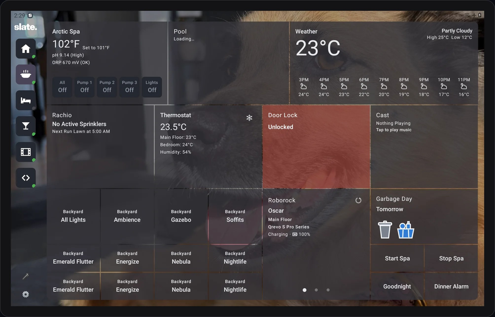
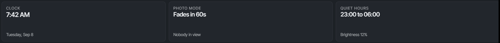
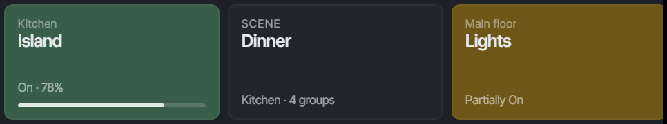
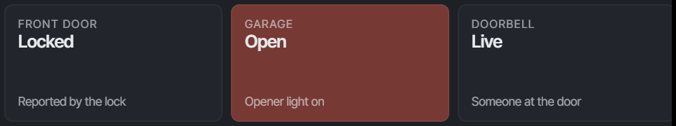
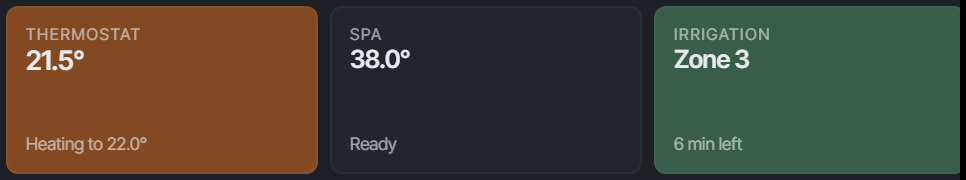
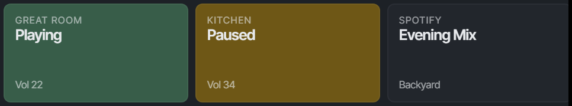
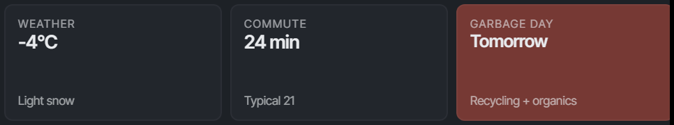
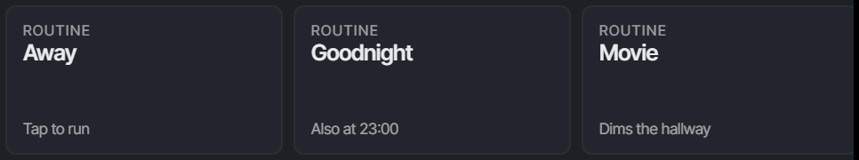
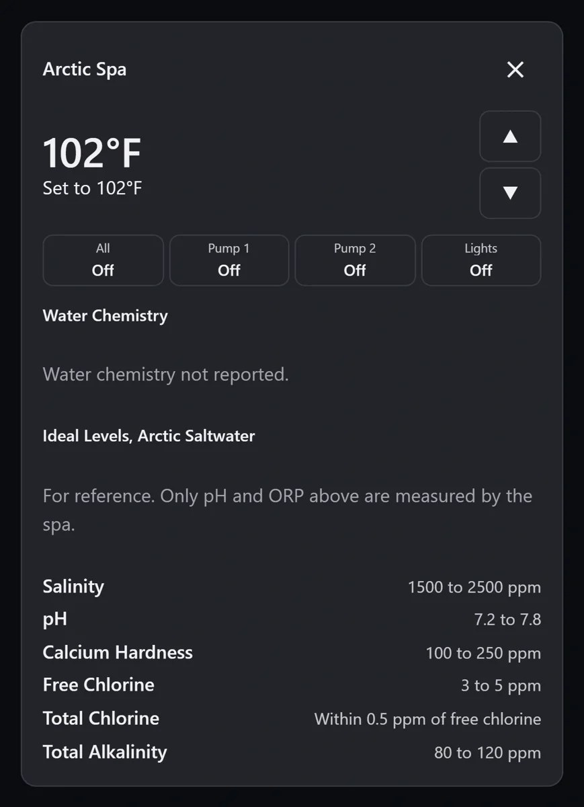
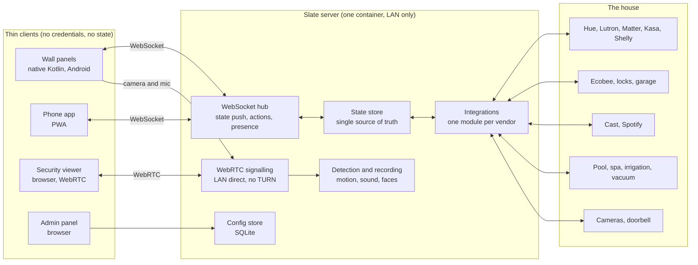

  <picture>
    <source media="(prefers-color-scheme: dark)" srcset="img/wordmark-dark.svg">
    
  </picture>

<strong>Everything your house knows, on one wall.</strong> 
Wall-mounted panels that are always on, one server that owns every integration, and nothing that needs the internet to work.

  

A real screenshot from a wall panel, not a mockup.

---

## What this repository is

Slate is a home control system I designed and built in 2026 for my own house. It is not a product, and it may never be one. The source is private: publishing the code for the locks, cameras and access systems in my own home would be a questionable demonstration of engineering judgment. This repository is the public description of what Slate is, what it controls, and how it is built.

The two public repositories:

| Repository | What it holds |
|---|---|
| **slate-overview** (this one) | What Slate is and how it is built, in words and pictures |
| [slate-dist](https://github.com/dfalpha/slate-dist) | The installer scripts and compose files a Slate server fetches. A CI-generated mirror of released files, never the source |

The idea itself, and a form for telling me whether you would want it in your house, is at **[slatepanel.app](https://slatepanel.app)**.

I'm [Shawn Snider](https://shawnsnider.me). The longer story is on that site.

## By the numbers

Measured in September 2026, six weeks after the first commit.

| | |
|---|---|
| From empty repository to production in my house | **6 weeks** |
| Lines of TypeScript and Kotlin | **~340,000** |
| Automated tests | **~7,400** |
| Device and service integrations | **17** |
| Codebases | **5**: server, tablet, admin, phone, viewer |
| Commits | **1,500+** |

## The whole house, in one place

Smart homes tend to become collections of apps. One for the lights, another for the thermostat, another for the cameras, another for the speakers, another for the pool. Slate makes them feel like one house again.

### The screen itself

Every room gets a panel designed for that room. The kitchen can show the whole house. The bedroom can put Goodnight, downstairs lights and the thermostat up front. The panel by the back door can care about the pool and spa. Layouts are changed from a browser and appear on the wall live.

When nobody is using a panel, the controls fade away and your own photos take over. Walk back and the house returns. Brightness settles automatically through the day and drops again overnight, so the hallway does not glow like an airport terminal at 2 AM.

### Lights & scenes

Hue bulbs and Lutron dimmers behave like lights, not competing ecosystems. A room gets one control even when several systems are behind it. Scenes can cross brands, so **Dinner**, **Movie** and **Away** describe what you want the room to do rather than which manufacturer's app to open.

And Slate reports what actually happened. If one lamp did not respond, the room does not pretend everything is off.

### Doors, garage & cameras

See whether doors are locked and the garage is open or closed from any panel in the house. Controls wait for the device to report back before changing state. A lock is not shown as locked because you pressed a button. It is shown as locked when the lock says it is.

Cameras can be viewed around the house, with recording and event detection handled centrally. When somebody rings the doorbell, nearby panels can become the doorbell. See who is there, talk to them, unlock the door, then get back to what you were doing.

### Climate, pool & outside

Heating and cooling, pool temperature, pumps, spa controls and irrigation all live in the same interface. Warm the hot tub from the panel by the back door. Stop the sprinklers because somebody wants to cross the lawn. Check whether the pool heater is actually running without visiting the equipment room.

The equipment can stay complicated. Using it does not have to be.

### Music & media

See what is playing, where it is playing and how loud it is. Start Spotify in a room, change the volume somewhere else, or stop the speakers the kids left running downstairs. The control follows the room, not the app that happens to provide the music.

### Things worth knowing

Some of the most useful tiles do not control anything. Weather for the next few hours. Current drive time compared with normal. Which bins go out tomorrow. Vacuum status. The temperature outside. Small things you check often enough that reaching for a phone starts to feel ridiculous.

### Routines & schedules

**Away. Goodnight. Movie.** One tap can run a sequence across lights, heating, screens, vacuums and other systems. The same routine can also happen on a schedule, or because something in the house changed.

The important part is that each step reports back. If one thing fails, the rest still happen, and Slate tells you what did not.

### And on your phone

  

The phone app is the same controls when you are out, driven by the same server. It is deliberately a thin client: control, status, routines and intercom, and none of the always-on behaviour that only makes sense on a wall.

 

## What it controls

Everything below runs through the server. No panel, phone or watch ever talks to a manufacturer directly, which is why one flaky integration cannot take the house down with it.

| Area | Integration | Notes |
|---|---|---|
| Lighting | Philips Hue | Multi-bridge. Several bridges behave as one namespace; one going offline does not stall the others |
| | Lutron Caséta & RA2 | Local LEAP connection. Dimmers, keypads, shades, and Pico remotes as buttons |
| | Matter lighting | Any Matter-certified bulb or switch, on Slate's own fabric |
| | TP-Link Kasa, Shelly | Plugs and relays behind the same vendor-neutral layer |
| Climate | Ecobee | Over HomeKit rather than the manufacturer API, which stopped accepting new applications years ago |
| | Matter thermostats | Direct, on the local fabric |
| Security | eufy cameras & doorbell | Live view, motion events and recording. Analysis runs on the server |
| | Matter locks | Lock, unlock and true state. Includes locks whose own app refuses remote commands |
| | ONVIF / RTSP cameras | Any camera that speaks ONVIF or plain RTSP |
| Water & outdoors | Rachio irrigation | Zones, schedules and the countdown to the next run |
| | Hayward OmniLogic | Pool pump, heater, lights and water temperature |
| | Arctic Spas | Spa temperature, pumps, lights and filtration |
| Media | Chromecast & Cast groups | What is playing, where, and control of it from any panel |
| | Spotify Connect | Rooms appear as Connect targets; playback is driven from the wall |
| House | Roborock vacuums | Status, consumables and start/stop per room |
| | Garage door controllers | Dry-contact relay and reed sensor. Reports true open/closed state rather than guessing from the last command |
| | Garbage & recycling | Municipal collection calendars, on the panel by the door |
| | Weather | Current conditions and forecast, fetched once by the server rather than by every screen |
| People | Microsoft 365 and Google calendars | Per-person, shown on the panels that person cares about |
| | Google Maps commute | Live drive times on your real routes |
| | Face recognition | Optional, off by default. Runs on the server, and the model never leaves it |

Some of these are reverse-engineered, because the vendor has no public API. Each one sits behind its own interface so that when a manufacturer changes something, one widget goes stale rather than the house stopping.

## Architecture

**The idea everything else follows from: the server is the brain, and the clients are thin.** A tablet never talks to Hue, a Lutron bridge, a camera or a thermostat. It renders state pushed to it over a WebSocket and sends actions back. Every integration, credential, poll and detection lives on the server, so a panel is a screen and a touch surface, nothing more.

### Why this shape

- **One poll fans out to every screen.** Six panels asking Hue for state six times a second is a way to get rate-limited. The server asks once and pushes the answer to everyone.
- **Secrets stay in one place.** Bridge keys, OAuth tokens and camera credentials exist only on the server. A wall panel holds no credentials, no keys and no stored state. Someone who walks off with one has an Android tablet. This is also why replacing one takes a minute.
- **Fragile integrations live in one codebase.** Reverse-engineered vendor protocols are maintained in one place and shipped to one process, not to every device on the wall.
- **State is honest.** The store reflects what devices report, not what was requested. A lock shows locked when the lock says so.

### The pieces

| Component | What it is |
|---|---|
| **Server** | Node.js and TypeScript. Owns every integration, the state store, the WebSocket hub, WebRTC signalling, motion and sound detection, recording, the config store, and hosts the admin panel and viewer. Ships as one container image with a reverse proxy in front for TLS |
| **Wall panel app** | Native Kotlin. Fetches its layout from the server, subscribes to state, renders widgets, sends actions. Always-on display, boot-on-power, night dimming, presence-based fade, photo slideshow, wake-word capture, intercom audio, and front-camera streaming for security. Built against a single Android 10 baseline on purpose |
| **Phone app** | A PWA served by the server. Same WebSocket and signalling APIs as the panels, with the always-on and capture behaviour deliberately left out |
| **Security viewer** | Browser app that streams a panel's camera and microphone over WebRTC, directly on the LAN |
| **Admin panel** | Browser app that edits all server-side configuration live: rooms, dashboards, widgets, integrations, routines, schedules, people |
| **Shared package** | Pure derivations that the admin panel and phone app both render from. Source-only, no dependencies, so the two clients cannot drift |

### Transport and liveness

Each panel holds one WebSocket to the server. State updates flow down, actions and presence flow up, and the same socket carries intercom and WebRTC signalling. The server pings every socket on a fixed interval and reaps any that do not answer by the next tick, so a dead connection is noticed within about forty seconds. That rule exists because of a production bug: panels that were logged in and working showed as offline, while a stale-token reconnect loop spun silently on a clean 401.

### Networking and privacy

- **LAN only.** The server binds to the local network, forwards no ports, opens no tunnel and keeps no persistent connection to anything outside the house. Remote access is your own VPN.
- **No relay.** WebRTC connects panel to viewer directly. There is no TURN server and no broker in the middle of a camera stream.
- **Host networking is mandatory.** Device discovery over mDNS, Matter commissioning and camera streams all need the server genuinely on the same segment as the hardware.
- **Detection runs on the server, not the panels.** 2018-era tablets cannot analyse video well. They stream; the server analyses and records to its own disk.
- **Voice stays home.** Wake word on the panel, recognition on the server, and the audio is discarded once the sentence is understood.
- **One documented exception.** The commute route map is Google's Maps JavaScript API loaded inside a WebView on the panel, because a static map does not pan or zoom. The key never ships in the app: the server stamps it into the page at request time. It is written up as a deliberate decision, not a precedent.

### The automation model

An **Action** is a list of steps: lights, scenes, switches, media, notifications, sounds, or a toggle that flips whatever it points at. Actions run from a schedule, from a device event, from a dashboard button, from voice, or from a Lutron Pico button. Each step reports back, so a partly failed routine says which part failed.

Pico remotes get a separate Action for press, double-press and long-press, plus hold-to-dim on the rocker buttons. Press timing is measured on the bridge rather than assumed, because Caséta hardware reports only press and release.

Every switched device is named and typed once. The ones marked as lights join **Lighting Groups** and **Scenes**; everything else gets its own tile. Adding a vendor means one server folder and a setup page, not changes across five clients.

## How it is built

**Hardware that is boring on purpose.** The server runs on any x86-64 machine with Docker and a wired connection. The panels are ordinary 10.5-inch Android tablets, mounted flush in the wall with a low-voltage feed. Nothing is proprietary and nothing locks you in.

**Develop against fake devices.** The server can serve plausible Hue bridges, Lutron zones and Pico remotes, Kasa plugs, Shelly relays and the rest, so no hardware is needed to work on it. The tablet app builds a `dev` flavour that installs alongside production with its own name and icon, so one test device can carry both.

**Promotion is deliberate, not automatic.** Every merge to `main` publishes a server image and distributes a tablet build to the dev group. The house moves to a new version only when I push a version tag, or dispatch the tablet promotion with the exact CI run whose build I want. What is promoted is the artifact CI already built and tested, and the installer files are mirrored to [slate-dist](https://github.com/dfalpha/slate-dist) on every promotion.

**Tested at the cheapest level that proves the point.** Roughly 7,400 automated tests across the server, the shared package, the two web clients and the tablet app. Anything that needs a real device goes on a human-only checklist.

**An operating contract for AI-assisted engineering.** I built Slate using Claude Code as the primary engineering tool, working under a written contract that fixes the constraints already decided, the workflow (plan first and get the plan approved, one issue per branch, a pull request into `main`, and `main` always runnable) and the definition of done. The judgment stayed mine: every architectural decision, every credential path and every release. The discipline that mattered most turned out to be verification: proving a thing works the way a person will use it, not the way the test happened to be written. Fifteen hundred commits in six weeks is the result.

## What is not here

The source, the house-specific configuration, and the vendor protocol details. If you are evaluating the engineering, [shawnsnider.me](https://shawnsnider.me) has the rest of the story, and I am happy to walk through the code in conversation. If you are wondering whether you would want Slate in your own house, [slatepanel.app](https://slatepanel.app) is the place to say so.

---

Designed and built in Ottawa, Canada. · <a href="https://www.linkedin.com/in/shawnsnider">LinkedIn</a> · shawn@shawnsnider.me

